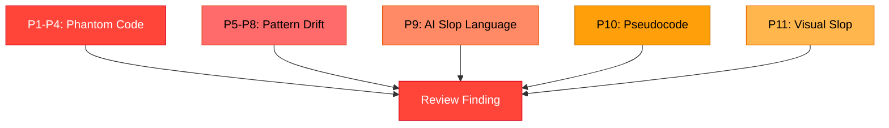

<p align="center">
  <picture>
    <source media="(prefers-color-scheme: dark)" srcset="docs/assets/header-dark.svg">
    <source media="(prefers-color-scheme: light)" srcset="docs/assets/header-light.svg">
    
  </picture>
</p>

<p align="center">
  <a href="LICENSE.md"></a>
  
  
</p>

---

> [!TIP]
> Use the detection patterns in your code review process. Copy `vibecode-detection.md` into your project, or reference it from your CI pipeline.

## The Problem

AI-generated code looks like it works but doesn't integrate with reality. It compiles (maybe) but calls nothing real, imports nothing installed, and follows patterns from a hallucinated API. We call this **vibecode**.

Vibecheck detects it before it ships.

## What It Detects



---

## Core Detection Patterns

| ID | Pattern | Severity | What It Catches |
|----|---------|----------|-----------------|
| **P1** | Phantom Dependency | Critical | Import references a package not in the manifest |
| **P2** | Phantom Module | Critical | Import references an internal file that doesn't exist |
| **P3** | Phantom Symbol | High | Call references a function not exported by the target |
| **P4** | Signature Mismatch | High | Function call with wrong args/types |
| **P5** | Pattern Alien | Medium | Code uses patterns from a different project |
| **P6** | Orphan Code | High | New code that nothing references |
| **P7** | God File Dump | Medium | Single file with multiple responsibilities |
| **P8** | Stub/Placeholder | Medium | LLM laziness markers where implementation should be |
| **P9** | AI Slop Language | Medium | LLM verbal tics in comments/strings (co-occurrence) |
| **P10** | Pseudocode | High | Non-compilable sketch code passed off as real |
| **P11** | AI Visual Slop | Medium | Generic AI-generated UI patterns |

Plus **23 auto-fail security patterns** (S01-S23) and **25+ grep rules** (G110-G133).

---

## Stack Coverage

| Stack | Coverage |
|-------|----------|
| TypeScript/React/Next.js | Full |
| Python (Django/Flask/crypto) | Full |
| Swift/iOS | Full |
| Go | Partial |
| Rust | Minimal |
| Docker/K8s/IaC | Full |
| CSS/Tailwind (visual slop) | Full |
| AI/LLM patterns | Partial |

---

## Quick Start

Copy the detection reference into your project:

```bash
curl -o vibecode-detection.md https://raw.githubusercontent.com/qinnovates/vibecheck-anti-vibecode/main/vibecode-detection.md
```

Or reference it in your code review checklist. The patterns use **ripgrep** (Rust regex syntax) and can be run with any `rg`-compatible tool.

> [!NOTE]
> All regex patterns are validated for ripgrep's Rust regex engine. No PCRE-only features.

---

## Features

| Feature | Description |
|---------|-------------|
| **11 Core Patterns** | P1-P11 covering phantom code, pattern drift, AI slop, pseudocode, visual slop |
| **23 Security Auto-Fails** | S01-S23 block merge unconditionally (hardcoded secrets, SQL injection, eval, etc.) |
| **25+ Grep Rules** | G110-G133 with ripgrep-valid regex, FP risk ratings, and two-pass guidance |
| **Co-occurrence Model** | P9 banned words use density scoring, not individual matches — reduces false positives |
| **9 Stack Coverage** | TypeScript, Python, Swift, Go, Rust, Docker/K8s, CSS/Tailwind, AI/LLM |
| **Quorum-Reviewed** | v4 stress-tested by 9-agent panel (Claude + Gemini + Codex) |

---

<details>
<summary><strong>Architecture</strong></summary>

```
vibecheck-anti-vibecode/
├── vibecode-detection.md    # The detection reference (core)
├── docs/
│   └── assets/
│       ├── header-dark.svg
│       └── header-light.svg
├── README.md
├── LICENSE.md
├── CLAUDE.md
└── .gitignore
```

**Current scope:** Detection reference (patterns + grep rules). The detection engine is a document, not a runtime — it's designed to be consumed by code review tools, CI pipelines, or human reviewers.

**Future:** GitHub App bot (`vibecheck-bot`) that runs these patterns on PRs automatically, like Dependabot but for AI slop.

</details>

---

## Roadmap

| Phase | Status | Features |
|-------|--------|----------|
| 1 | Done | Core detection reference (P1-P11, S01-S23, G01-G133) |
| 2 | Planned | CLI tool (`vibecheck scan .`) |
| 3 | Planned | GitHub App bot (PR comments, like Dependabot) |

---

## Development

The detection reference was built and reviewed using:

- **gstack** design-checklist for visual slop patterns (10-item AI Slop Blacklist)
- **ui-ux-pro-max** anti-pattern database for color/typography validation
- **Quorum v7.3.0** `--max --diverse` for cross-model adversarial review (Claude + Gemini 2.5 Pro + Codex/GPT-5.2)

---

## License

[MIT](LICENSE.md)

---

<p align="center">Built by <a href="https://github.com/qinnovates">qinnovates</a></p>
